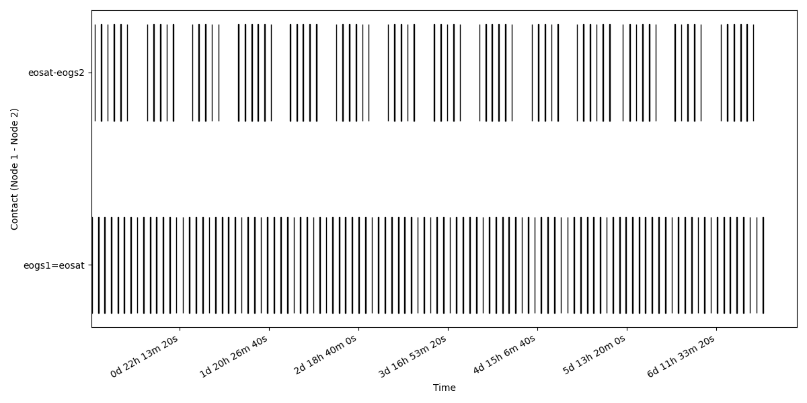
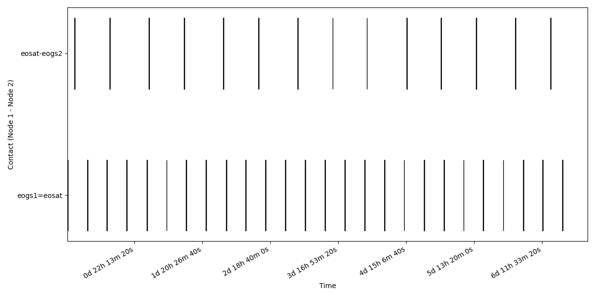
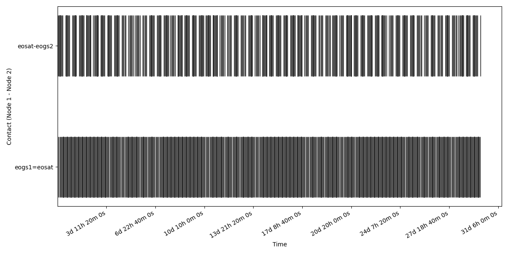
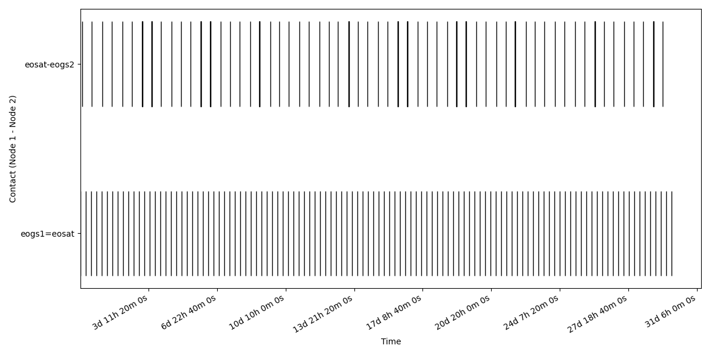
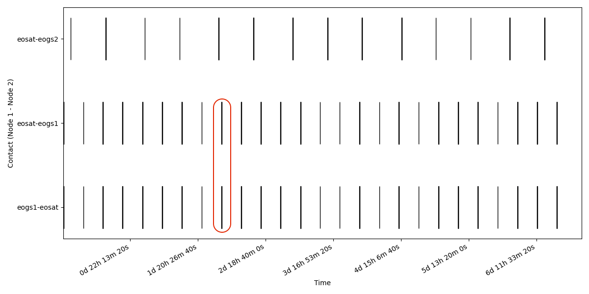
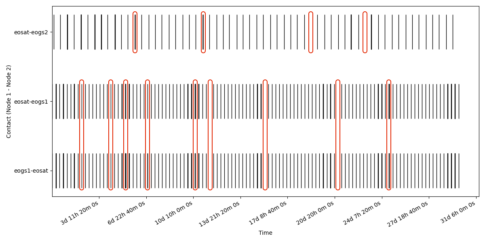

= Low Earth Orbit Scenario 1.0.1

=== Description
The Low Earth Orbit (LEO) scenario is the simplest DTN scenario with a single satellite, 2 ground stations, 1 mission control centre (MCC) and 1 payload centre. In this scenario the satellite passes are frequent, and data can be downlinked at both high and low speed to different stations.
A typical LEO mission orbit has a large inclination and relatively low altitude. In this scenario the inclination is 90 degrees, and the elevation is 7000 Km from the centre of the earth. The ground stations with best visibility are the one at high latitude, close to the poles. For terrestrial IP links (N in Fig. 4) we have a maximum throughput of 1 Gbps and a 10 ms latency. While on the space links (SL), we have different throughput on different link directions and ground stations, such as 10 Gbps downlink for payload data, 8 Mbps for housekeeping telemetry and 64 kbps uplinks. Having much larger downlink data rates for the space link than on the terrestrial link is quite typical for upcoming Low Earth Orbit missions and requires data buffering and complex data distribution concepts on ground. 

=== Topology
The scenarios has 5 DTN nodes:

*	1 Mission Control Centre.
*	1 Payload Control Centre.
* 1 Ground Station, close to the north pole, providing up and downlink.
*	1 Ground Station, one close the south pole, providing donwlink only. 
*	1 Low Earth Orbit Satellite.

[.text-center]
.Low Earth Orbit Topology
image::images/leo.png[Topology, 500, 500]

=== Ground Assets
[cols="h,^.^,^.^,^.^,^.^,^.^,^.^"]
|===
|  Ground Asset id     | Ground Asset name | Cartesian X | Cartesian Y | Cartesian Z | Reference Center | Reference Axis 

|eogs1
|Ground Station 1
|1258.67281193 km
|346.67261938 km
|6222.63364257 km
| Earth
| ITRF

|eogs2
|Ground Station 2
|1973.63615409 km
|87.32009812 km
|-6045.46982072 km
| Earth
| ITRF

|===

=== Orbital Parameters
[cols="h,^.^,^.^,^.^,^.^,^.^,^.^,^.^,^.^,^.^"]
|===
|  Flying Asset id     | Flying Asset name | Center of Orbit | Orbital Axes | Semi-major axes | Eccentricity | Inclination | Right Ascension | Argument of pericentre | True anomaly at reference epoch 

|eosat
|Low Earth Orbit Satellite
|Earth
|ICRF
|7000 km
|0
|90 deg
|0 deg
|0 deg
|0 deg

|===

=== Data Rates
The data rates are provided for each couple of nodes in the topology and are based on estimates of the capability of a near future Low Earth Orbit mission.
The terrestrial links are symmetric while the space links are asymmetric and with different capabilities depending on the ground station. One ground station is dedicated to downlink of housekeeping data and the second one, with higher throughput capability, for the payload data.

[cols="h,^.^,^.^,^.^,^.^,^.^,^.^"]
|===
|     | destination   | Mission Control Centre | Payload Control Centre | Ground Station 1 | Ground Station 2 | Satellite

|source
|
|
|
|
|
|

|Mission Control Centre
|
|-
|0
|100 Mbps
|100 Mbps
|0

|Payload Control Centre
|
|0
|-
|100 Mbps
|1000 Mbps
|0

|Ground Station 1 
|
|100 Mbps
|100 Mbps
|-
|0
|64 Kbps

|Ground Station 2
|
|100 Mbps
|1000 Mbps
|0
|-
|0

|Satellite
|
|0
|0
|8 Mbps
|10 Gbps
|-

|===

NOTE: Scaling factor could be applied for data rate and data volumes to run the scenario with less performant hardware. Simulating a 10Gpbs downlink can be limited by hardware capabilities, scaling the  data rates and volumes by a factor 10 can help mitigate the requirements to run a simulation on less powerful hardware.

NOTE: The source of the data is on the left column and the destination on the upper row. The link are unidirectional and the table is not diagonally symmetric, thus reading the table from the top row may induce to a wrong value reading. The correct value should be read from the left column with the source as the starting reference.

- Every terrestrial link has a delay of 150ms.
- Every on board asset has a delay based on the OWLT computed at the distance of the assets at the beginning of the pass plus an additional 50ms processing delay.

=== Traffic Types and Volumes
We define three traffic types for this scenario:

-	Telecommand (TC) for commands to the spacecraft: 512 bytes of data every 5 minutes.
-	Housekeeping Telemetry \(TM) for mointoring of the spacecraft: 64KB of data every minute.
-	Scientific data generated by the PAYLOAD for downlink: 10MB of data every 1 seconds, resulting in about 0.85TB of data every day.

The traffic has link restrictions, such that PAYLOAD can only flow in high throughput links of the second ground station; TC and TM can only flow in lower data rate links with the first ground station. All types can flow over static links.

=== Communication Planning
The communication planning applied in the scenario to obtain the __actual contacts__ considers various factors. The minimum pass duration is set to 6 minutes for the pass to be considered acceptable and given the data rate involved for payload we can calculate (without link errors) to send about 450 GB of data per pass. Tha would require 2/3 passes a day to downlink the 1TB target data, depending on the pass length. With a safety margin for overheads we can safely take 3 passes per day with bandwidth to spare. Assuming the minimum length of 6 minutes we have a potential minimum data transfer of 1.35 TB (without considering errors) per day, that provides 35% safety margin on the generated data.
For TM and TC we would consider 4 pass per day, not constraint by data handling but on spacecraft conditions and safe operations.

Planned contacts heuristics:

- Visibility duration of at least 6 minutes.
- For Housekeeping data, one pass every 6 hours, 4 passes per day.
- For payload data, one pass every 8 hours, 3 passes per day.

[.text-center]
.Asset visibility over 7 days

[.text-center]
.Planned Contacts links over 7 days

[.text-center]
.Asset visibility over 30 days

[.text-center]
.Planned Contacts links over 30 days

=== Error Model
In this scenario the error model is defined as:

* Probability of lost communication P~l~ = 1%
* Probability of burst error during communication P~b~ = 2%
- A contact affected by burst error can have 1 to 10 errors of integer length between 1 and 5 seconds.
* Probability of delayed start or early end P~d~ = 2%
- The delay can last a number of seconds between 10 and 60 with incremental steps of 10 secons, if the delay is longer than 1 minutes, the pass is dropped.
- P~d~ only consider late start of a pass since early ends are extermely unlikely and passes are short. Please also note that a delayed pass (P~d~) with very late start (>1m for LEO) is automatically discarded and become a lost contact.

[.text-center]
.Actual Contacts links over 7 days

[.text-center]
.Actual Contacts links over 30 days

Note: In the __actual contacts__ images, the link errors have been circled in red to highlight the differences with the __planned contacts__. 
