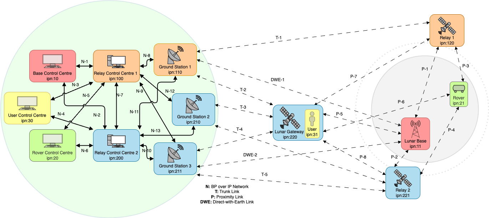
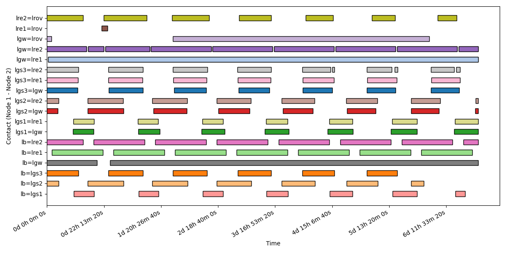
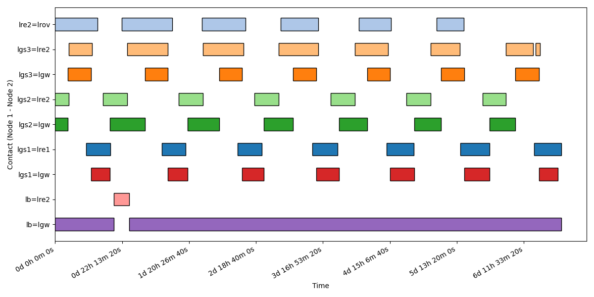
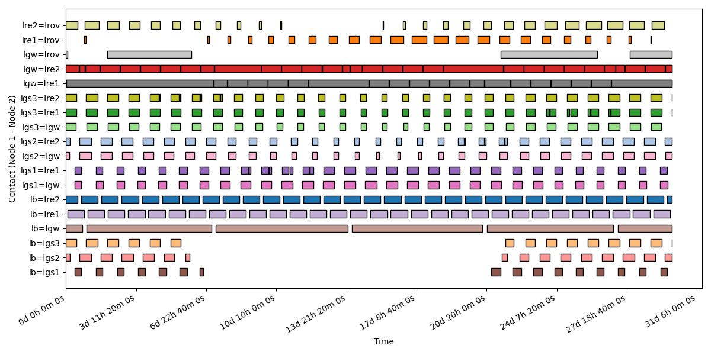
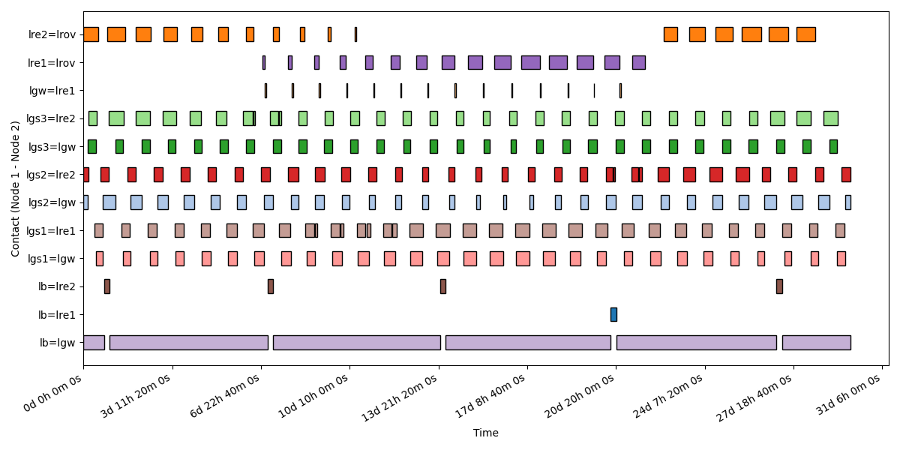
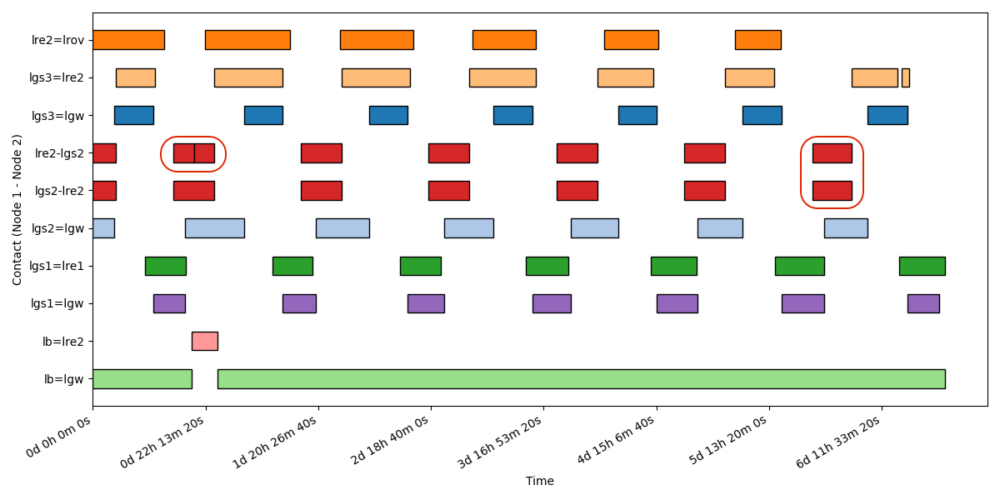
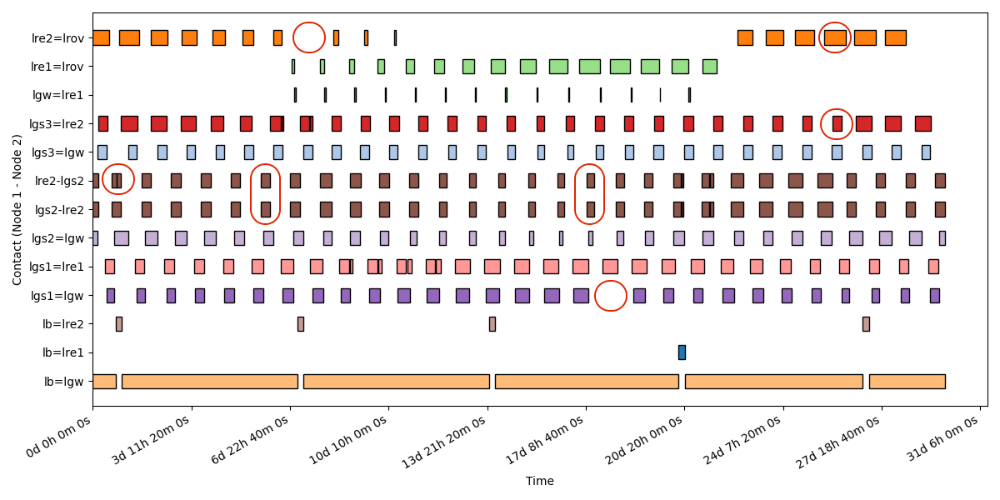

= Lunar Communication Scenario 1.0

=== Scenario definition
The Lunar Communication scenario has two service providers. The first provider manages 1 control centre, 1 relay control centre, 1 GS, 1 relay and 1 lunar asset. The second provider manages 1 control centre, 1 relay control centre, 2 GS, 1 relay and the lunar gateway able to communicate with all ground stations and relays as well as lunar assets. The other lunar relays provides local connectivity to further assets on the surface.

The orbit considered for the lunar gateway is realistic, while the two orbits of the Relays are approximation of a realistic orbits for a future lunar constellation. Also, the lunar assets position has been considered to be realistically accurate for a future lunar exploration missions <<landing, [1]>>. In Fig. 1 different assets of different organisational entities are represented with different colours and cross support is possible between the two entities managing the relay satellites and ground stations. The lunar base position is considering solar illumination and zones of interests for exploration <<illumination, [2]>>. The rover is placed on the far side of the moon so that the DTN capabilities can be properly tested in a sparsely connected environment. In this scenario we have a variety of link throughput and latencies. Terrestrial IP network in this scenario has a maximum throughput of 100 Mbps, the trunk links have a 100 Mbps downlink and 30 Mbps uplink. For lunar assets maximum throughputs are harder to define as different sources provide different capabilities, from 30 Mbps down to 2 Mbps for the rover and lunar base uplink and downlink.

=== Topology
The scenario has 13 DTN nodes separated in 5 different entities (colour coded the <<Topology, image>>):

-	In red, lunar south pole base and a base control centre.
-	In green, a rover on the lunar far side and a rover control centre.
-	In Yellow, a user on board of the Lunar Gateway and a user control centre.
-	In Orange, a service provider that controls a relay control centre, a ground station and a lunar relay satellite.
-	In Blue, a service provider that control a relay control centre, two ground station, a lunar relay satellite and the lunar gateway.

It is important to note that the rover is on the far side of the moon and has no direct with Earth link connectivity. The lunar base position has been selected so that DWE connectivity is available, this is a desirable requirement for future exploration activity on the moon south pole.

=== Ground Assets
[cols="h,^.^,^.^,^.^,^.^,^.^,^.^,^.^"]
|===
|  Ground Asset id     | Ground Asset name | Cartesian X | Cartesian Y | Cartesian Z | Reference Center | Reference Axis | Notes

|lgs1
|Ground Station 1
|-2414.0674201 km
|4907.8694597 km
|-3270.6048732 km
|Earth
|ITRF
| ESTRACK New Norcia

|lgs2
|Ground Station 2
|4849.5252463721 km
|-360.606088513 km
|4114.4951006 km
|Earth
|ITRF
| DSN Madrid

|lgs3
|Ground Station 3
| -2351.1126626803 km
| -4655.5306184282 km
| 3660.9126875 km
|Earth
|ITRF
| DSN Goldstone

|lrov
|Lunar Rover
| -1737.4 km
| 0.0 km
| 0.0 km
|Moon
|MoonIAU2009
| Rover on the far side

|lb
|Lunar Base
| -13.0 km
| -12.47 km
| -1737.4 km
|Moon
|MoonIAU2009
| Lunar Base on the South Pole

|===

=== Orbital Parameters

[cols="h,^.^,^.^,^.^,^.^,^.^,^.^,^.^,^.^,^.^"]
|===
|  Flying Asset id     | Flying Asset name | Center of Orbit | Orbital Axes | Semi-major axes | Eccentricity | Inclination | Right Ascension | Argument of pericentre | Notes

|lre1
|Lunar Relay 1
|Moon
|MoonIAU2009
|9750.7 km
|0.7
|63.2 deg
|0 deg
|90 deg
| Moonlight Navigation Services, see reference <<mns, [3]>>

|lre2
|Lunar Relay 2
|Moon
|MoonIAU2009 frozen at J2000
|9750.7 km 
|0.7
|63.2 deg
|120 deg
|90 deg
| Moonlight Navigation Services, see reference <<mns, [3]>>

|lgw
|Lunar Gateway
| see reference <<lgw, [4]>>
| see reference <<lgw, [4]>>
| see reference <<lgw, [4]>>
| see reference <<lgw, [4]>>
| see reference <<lgw, [4]>>
| see reference <<lgw, [4]>>
| see reference <<lgw, [4]>>
| Lunar Gateway

|===

Note: For the contact planning of the relays (except the Lunar Gateway) Keplerian dynamics has been assumend for the propagation of the orbits with the above parameters.

=== Data Rates

[cols="h,^.^,^.^,^.^,^.^,^.^,^.^,^.^,^.^,^.^,^.^,^.^,^.^,^.^"]
|===
|  source\destination     | Base Control Centre | User Control Centre | Rover Control Centre | Relay Control Centre 1 | Relay Control Centre 2 | Ground Station 1 | Ground Station 2 | Ground Station 3 | Gateway | Relay 1 | Relay 2 | Rover | Lunar Base

|Base Control Centre
|-
|0
|0
|100
|100
|0
|0
|0
|0
|0
|0
|0
|0

|User Control Centre
|0
|-
|0
|100
|100
|0
|0
|0
|0
|0
|0
|0
|0

|Rover Control Centre
|0
|0
|-
|100
|100
|0
|0
|0
|0
|0
|0
|0
|0

|Relay Control Centre 1
|100
|100
|100
|-
|100
|100
|100
|100
|0
|0
|0
|0
|0

|Relay Control Centre 2
|100
|100
|100
|100
|-
|100
|100
|100
|0
|0
|0
|0
|0

|Ground Station 1
|0
|0
|0
|100
|100
|-
|0
|0
|30
|30
|0
|0
|5

|Ground Station 2
|0
|0
|0
|100
|100
|0
|-
|0
|30
|0
|30
|0
|5

|Ground Station 3
|0
|0
|0
|100
|100
|0
|0
|-
|30
|0
|30
|0
|5

|Gateway
|0
|0
|0
|0
|0
|100
|100
|100
|-
|15
|15
|100
|100

|Relay 1
|0
|0
|0
|0
|0
|100
|100
|100
|15
|-
|15
|100
|100

|Relay 2
|0
|0
|0
|0
|0
|100
|100
|100
|15
|15
|-
|100
|100

|Rover
|0
|0
|0
|0
|0
|0
|0
|0
|15
|15
|15
|-
|0

|Lunar Base
|0
|0
|0
|0
|0
|25
|25
|25
|15
|15
|15
|0
|-

|===

NOTE: The source of the data is on the left column and the destination on the upper row. The link are unidirectional and the table is not diagonally symmetric, thus reading the table from the top row may induce to a wrong value reading. The correct value should be read from the left column with the source as the starting reference.

- Every ground asset has a delay of 150ms.
- Every on board asset has a delay based on the OWLT computed at the distance of the assets at the beginning of the pass plus an additional 50ms processing delay.

=== Traffic Types and Volumes
Every flying and lunar asset produce TM&TC as defined in the EO scenario:

-	Telecommand (TC) for commands to the spacecraft: 512 bytes of data every 5 minutes.
-	Housekeeping Telemetry \(TM) for mointoring of the spacecraft: 64KB of data every minute.

The lunar base, rover and user on the Lunar Gateway also produce:

-	Scientific data generated by the PAYLOAD for downlink: 64KB of data every 1 seconds, for about 230 MB of data every hour.

=== Communication Planning
The communication planning fo the lunar communication scenario used to obtain the __actual contacts__ is built around a hard requirements for the lunar base and gateway, that requires 24/7 coverage.

- The lunar base requires 24/7 coverage from relays.
- The lunar gateway requires 24/7 coverage from ground.

In order to provide 24/7 coverage for the lunar gateway, three ground stations are required, the planning optimise the station coverage with no overlaps between ground stations.
In this scenario, the ground stations are considered as ground station complex, that can cover multiple downlink/uplink at the same time.

Planned contacts heuristics:

- 24/7 GS coverage for the LGW, with 3 ground stations sharing the coverage.
- The GS passes are optimised based on duration and availability.
- 24/7 relay coverage fro the lunar base, provided mostly by the LGW, with visibility gaps covered by other relays.
- Normal relays (not lgw) only communicate with ground stations of the same service provider.
- Normal relays can only communicate with one ground station at the time.
- Optimised lunar rover coverage between the two normal relays.
- A proximity link with the lgw is available for 30 minutes after a lunar rover pass to the service provider not managing the lgw.
- Proximity links between relays is not planned apart from the above case.
- LGW does not cover the rover, as the orbit provides minimal pass time.

With the provided topology and orbits, the heuristics provide a simplified but realistic communication planning between all the assets.

[.text-center]
.Asset visibility over 7 days

[.text-center]
.Planned Contacts links over 7 days

[.text-center]
.Asset visibility over 30 days

[.text-center]
.Planned Contacts links over 30 days

=== Error Model
In this scenario the error model is defined as:

* Probability of lost communication P~l~ = 1%
* Probability of burst error during communication P~b~ = 2%
- A contact affected by burst error can have 1 to 10 errors of integer length between 1 and 5 seconds.
* Probability of delayed start or early end P~d~ = 2%
- The delay can last an integer number of minutes between 1 and 10, if the delay is longer than the length of the pass, the pass is dropped.
- The early end can last an integer number of minutes between 1 and 5, if the early end is larger than the contact length , the pass is dropped.

The provided error model is much higher than what is to expected on a mission. It is provided to have a simple but interesting scenario. A user is expected to produce more realistic probabilities and produce an __actual contacts__ file for more specific purposes or utilise a more sophisticated method to insert errors in the network.

[.text-center]
.Actual Contacts links over 7 days

[.text-center]
.Actual Contacts links over 30 days

Note: In the __actual contacts__ images, the link errors have been circled in red to highlight the differences with the __planned contacts__. 

=== References
Comprehensive list of public references used to produce the scenario.

* [1][[landing]] Sathyan et al. (2024). Potential landing sites characterization on lunar south pole: De-Gerlache to Shackleton ridge region. Icarus, 412, [Online]. Available: https://www.sciencedirect.com/science/article/pii/S0019103524000460 
* [2] [[illumination]] Peña-Asensio et al. (2025). Evaluating potential landing sites for the Artemis III mission using a multi-criteria decision making approach. Acta Astronautica, 226, 469–478, [Online]. Available: https://www.sciencedirect.com/science/article/pii/S0094576524006234
* [3] [[mns]] Giordano et al. (2021). Moonlight navigation service: How to land on peaks of eternal light, [Online]. Available: 
, https://www.researchgate.net/publication/358266257_Moonlight_navigation_service_-_how_to_land_on_peaks_of_eternal_light
* [4] [[lgw]] Lunar Gateway Ephemeris, [Online]. Available: https://naif.jpl.nasa.gov/naif/public.html

Others:

* LunaNet Interoperability Specification Document, Version 5, [Online]. Available: https://www.nasa.gov/wp-content/uploads/2025/02/lunanet-interoperability-specification-v5-baseline.pdf?emrc=606f95
* Lunar Communication Architecture Working Group, IOAG, “The Future Lunar Communications Architecture”, V1.3, Jan. 31, 2022. [Online]. Available: https://www.ioag.org/Public%20Documents/Lunar%20communications%20architecture%20study%20report%20FINAL%20v1.3.pdf
* https://logic.jhuapl.edu/ - Lunar Operating Guidelines for Infrastructure Consortium
* https://www.ipnsig.org/ - Interplanetary Networking Special Interest Group (IPNSIG)
