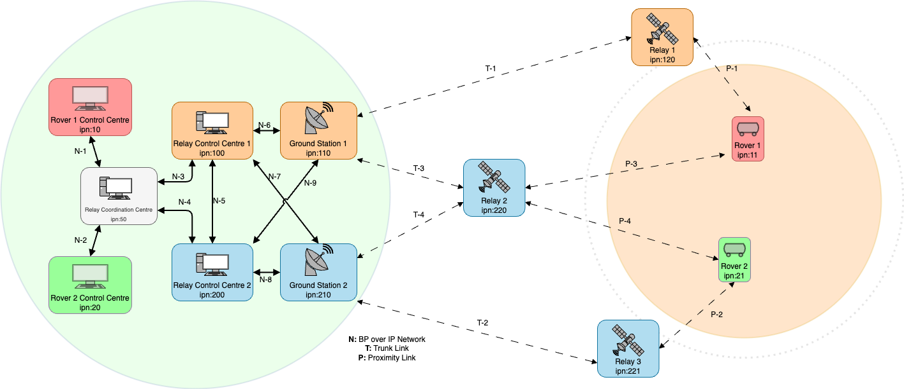
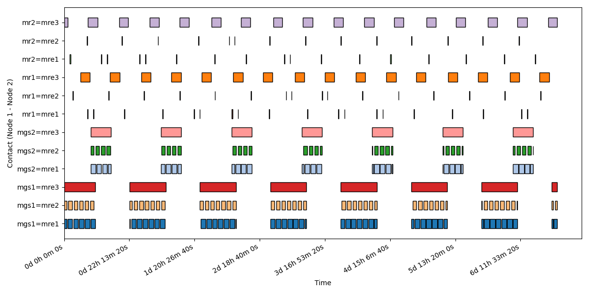
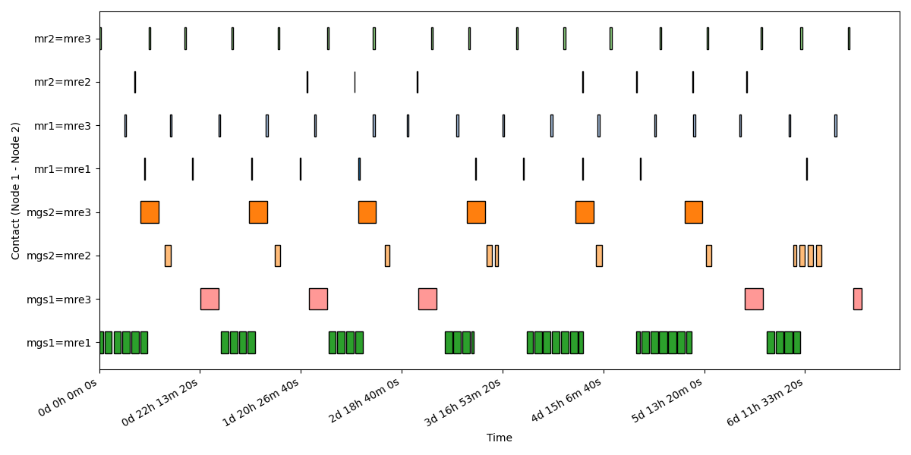
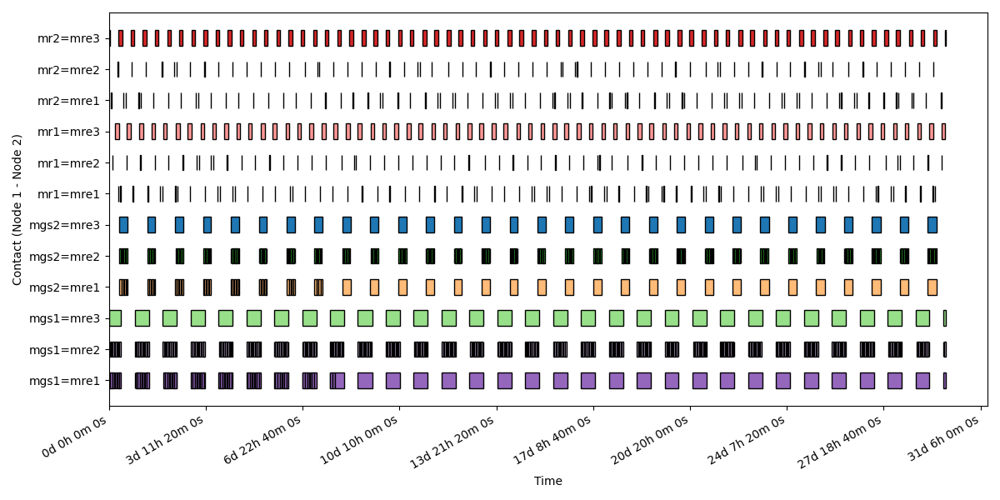
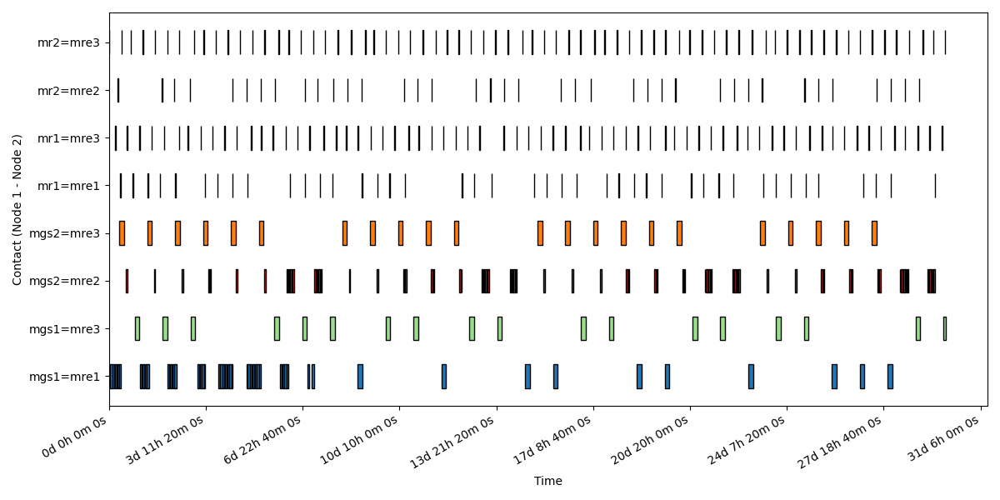
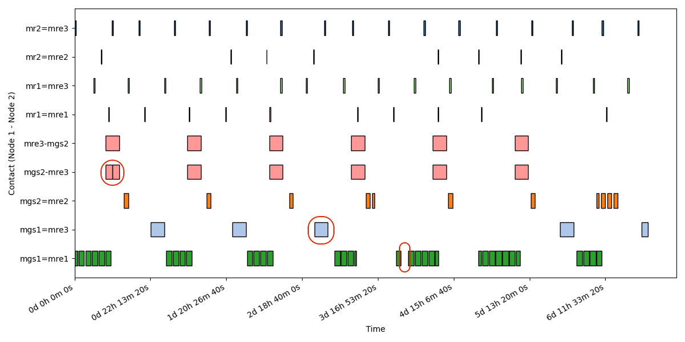
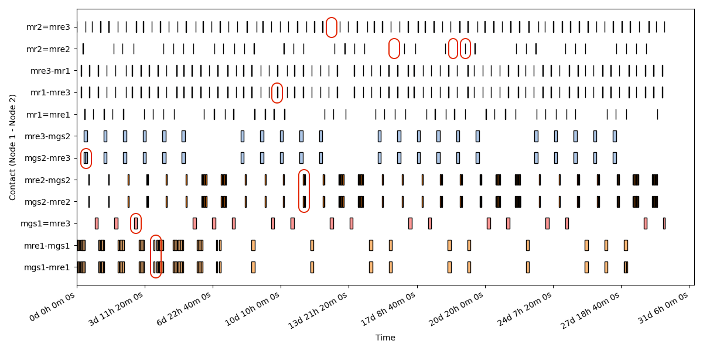

= Mars Communication Scenario 1.0

=== Scenario definition
The Mars communication scenario keeps a similar topology to the Lunar scenario, however relays cannot communicate between each others and links have much larger delays between Earth and Mars.
In this scenario we have two service providers, with respectively one and two relay orbiters. Both providers have a low altitude orbiter and the second provider a high altitude one as well that provides coverage for both rovers. In this scenario the contacts are much more sparse and shorter in time, providing a more challenging communication environment. Direct links with Earth are not available, and relays do not communicate between each other to relay data, as the current Mars Orbiters are alos not communicating with each other. For this scenario the Mars Relay Network [8] and the IOAG report on Mars [12] have been an important source of information to determine relay orbits and links capabilities. The maximum links throughput is very similar to the Lunar Communication scenarios. However, the average latency for non-terrestrial links is much larger, with an average of 10 minutes.

=== Topology
The scenario has 11 DTN nodes separated in 5 different domains (colour coded in the <<Topology, image>>):

-	In red and green, two different rovers with dedicated rover control centre.
-	In white, a relay coordination centre.
-	In Orange, a service provider that control a relay control centre, a ground station and a low orbit relay.
-	In Blue, a service provider that control a relay control centre, a ground station, a low and a high orbit relay satellites.

Relay 1 and 2 are low orbit relay and connects only to their respective ground stations while Relay 3 is a high altitude Relay and can communicate to the ground stations of both agencies.

=== Ground Assets
[cols="h,^.^,^.^,^.^,^.^,^.^,^.^,^.^"]
|===
|  Ground Asset id     | Ground Asset name | Cartesian X | Cartesian Y | Cartesian Z | Reference Center | Reference Axis | Notes

|mgs1
|Ground Station 1
|-2414.0674201 km
|4907.8694597 km
|-3270.6048732 km
|Earth
|ITRF
| ESTRACK New Norcia

|mgs2
|Ground Station 2
|4849.5252463721 km
|-360.606088513 km
|4114.4951006 km
|Earth
|ITRF
| DSN Madrid

|mr1
|Mars Rover 1
|2935.530 km
|-1327.540 km
|1056.704 km km
|Mars Barycenter
|Mars
| Rosalin Franklin Rover, Oxia Planum

|mr2
|Mars Rover 2
|696.281 km
|3141.524 km
|1072.815 km
|Mars Barycenter
|Mars
| Perseverance Rover, Jefero crater
|===

=== Orbital Parameters
[cols="h,^.^,^.^,^.^,^.^,^.^,^.^,^.^,^.^,^.^,^.^"]
|===
|  Flying Asset id     | Flying Asset name | Center of Orbit | Orbital Axes | Semi-major axes | Eccentricity | Inclination | Right Ascension | Argument of pericentre | True anomaly at reference epoch | Notes

|mre1
|Mars Relay 1
|Mars Barycenter
|MME2000
|3796.19 km
|0
|74 deg
|0 deg
|0 deg
|0 deg
| Trace Gas Orbiter

|mre2
|Mars Relay 2
|Mars Barycenter
|MME2000
|3655.0 km
|0.0078
|92.7 deg
|95.9 deg
|258.9 deg
|49.9 deg
| Mars Reconnaissance Orbiter

|mre3
|Mars Relay 3
|Mars Barycenter
|MME2000
|9116 km
|0
|20 deg
|0 deg
|0 deg
|0 deg
| MARCONI

|===

Note: For the contact planning Keplerian dynamics has been assumend for the propagation of the orbits with the above parameters.
Note: The reference epoch is 2026-01-01T00:00:00.00.

=== Data Rates

[cols="h,^.^,^.^,^.^,^.^,^.^,^.^,^.^,^.^,^.^,^.^,^.^,^.^"]
|===
|  source\destination     | Rover Control Centre 1 | Rover Control Centre 2 | Relay Coordination Centre | Relay Control Centre 1 | Relay Control Centre 2 | Ground Station 1 | Ground Station 2 | Relay 1 | Relay 2 | Relay 3 | Rover 1 | Rover 2

|Rover Control Centre 1
|-
|0
|100 Mbps
|0
|0
|0
|0
|0
|0
|0
|0
|0

|Rover Control Centre 2
|0
|-
|100 Mbps
|0
|0
|0
|0
|0
|0
|0
|0
|0

|Relay Coordination Centre
|100 Mbps
|100 Mbps
|-
|100 Mbps
|100 Mbps
|0
|0
|0
|0
|0
|0
|0

|Relay Control Centre 1
|0
|0
|100 Mbps
|-
|100 Mbps
|100 Mbps
|100 Mbps
|0
|0
|0
|0
|0

|Relay Control Centre 2
|0
|0
|100 Mbps
|100 Mbps
|-
|100 Mbps
|100 Mbps
|0
|0
|0
|0
|0

|Ground Station 1
|0
|0
|0
|100 Mbps
|100 Mbps
|-
|0
|30 Mbps
|30 Mbps
|0
|0
|0

|Ground Station 2
|0
|0
|0
|100 Mbps
|100 Mbps
|0
|-
|0
|30 Mbps
|30 Mbps
|0
|0

|Relay 1
|0
|0
|0
|0
|0
|100 Mbps
|100 Mbps
|-
|0
|0
|100 Mbps
|100 Mbps

|Relay 2
|0
|0
|0
|0
|0
|100 Mbps
|100 Mbps
|0
|-
|0
|100 Mbps
|100 Mbps

|Relay 3
|0
|0
|0
|0
|0
|100 Mbps
|100 Mbps
|0
|0
|-
|100 Mbps
|100

|Rover 1
|0
|0
|0
|0
|0
|0
|0
|15 Mbps
|15 Mbps
|15 Mbps
|-
|0

|Rover 2
|0
|0
|0
|0
|0
|0
|0
|15 Mbps
|15 Mbps
|15 Mbps
|0
|-

|===

NOTE: The source of the data is on the left column and the destination on the upper row. The link are unidirectional and the table is not diagonally symmetric, thus reading the table from the top row may induce to a wrong value reading. The correct value should be read from the left column with the source as the starting reference.

- Every terrestrial link has a delay of 150ms.
- Every on board asset has a delay based on the OWLT computed at the distance of the assets at the beginning of the pass plus an additional 50ms processing delay.

=== Traffic Types and Volumes
We define three traffic types for this scenario, every relay and rover produce:

-	Telecommand (TC) for commands to the spacecraft: 512 bytes of data every 5 minutes.
-	Housekeeping Telemetry \(TM) for mointoring of the spacecraft: 64KB of data every minute.

The rovers additionally produce:

-	Scientific data generated by the PAYLOAD for downlink:: 64KB of data every 1 seconds, for about 230 MB of data every hour.

=== Communication Planning
The communication planning fo the mars communication scenario used to obtain the __actual contacts__ considers various factors. Since one of the relays orbit at much higher altitute and availability, a limit of 25 minutes per pass over the rover is set.

Planned contacts heuristics:

- Visibility duration of at least 30 minutes.
- Maximum pass duration between a GS and an orbiter 4 hours, after that the pass is truncated.
- Minimum pass duration between a GS and an orbiter to be considered a valid pass is 30 minutes.
- Maximum pass duration between a rover and an orbiter is 25 minutes.
- Minimum pass waiting time to the next pass between a rover and an orbiter is 3 hours.

With the provided topology and orbits, the heuristics provide a simplified but realistic communication planning between all the assets.

[.text-center]
.Asset visibility over 7 days

[.text-center]
.Planned Contacts links over 7 days

[.text-center]
.Asset visibility over 30 days

[.text-center]
.Planned Contacts links over 30 days

=== Error Model
In this scenario the error model is defined as:

* Probability of lost communication P~l~ = 1%
* Probability of burst error during communication P~b~ = 2%
- A contact affected by burst error can have 1 to 10 errors of integer length between 1 and 5 seconds.
* Probability of delayed start or early end P~d~ = 2%
- The delay can last an integer number of minutes between 1 and 10, if the delay is longer than the length of the pass, the pass is dropped.
- The early end can last an integer number of minutes between 1 and 5, if the early end is larger than the contact length , the pass is dropped.

The provided error model is much higher than what is to expected on a mission. It is provided to have a simple but interesting scenario. A user is expected to produce more realistic probabilities and produce an __actual contacts__ file for more specific purposes or utilise a more sophisticated method to insert errors in the network.

[.text-center]
.Actual Contacts links over 7 days

[.text-center]
.Actual Contacts links over 30 days

Note: In the __actual contacts__ images, the link errors have been circled in red to highlight the differences with the __planned contacts__. 

=== References
The following references have been used to produce the scenario.

* https://www.ipnsig.org/
* https://ieeexplore.ieee.org/document/10521332
* https://www.planetary.org/space-images/mars_landing_site_map_lakdawalla
* https://www.researchgate.net/publication/386416222_Martian_Navigation_Exploiting_the_MARCONI_Navigation_Services

